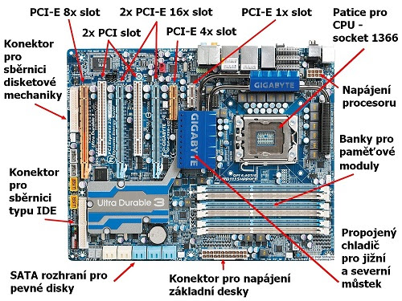

# 1 - Počítač a jeho stavba
**Počítač je elektronické zařízení, které je schopné provádět různé typy výpočtů a 
manipulací s daty podle instrukcí zadaných uživatelem nebo předem naprogramovaných 
algoritmů**. Moderní počítače jsou obvykle tvořeny několika základními komponenty, 
které spolupracují k dosažení požadovaného výkonu. 

Mezi tyto komponenty patří:

## **1. Procesor (CPU)**: 
Je to možná **nejdůležitější část počítače, říká se mu také mozek počítače**.
**Provádí všechny výpočty a operace**. **Moderní procesory jsou často vybaveny více jádry**,
což jim umožňuje provádět více úloh současně.

### 1.1 Architektura: 
Procesor má složitou architekturu, která zahrnuje několik základních částí. 
Mezi tyto části patří **aritmeticko-logická jednotka (ALU), řadič instrukcí, 
registry a jednotky řízení**. Tyto části spolupracují k 
provádění operací a manipulaci s daty.

Existuje několik různých architektur procesorů, 
z nichž každá má své vlastní charakteristiky a využití. 
**Mezi nejběžnější architektury procesorů patří**:

#### 1.1.1 x86: 
**Architektura x86 je nejběžnější architekturou procesorů v osobních počítačích a serverech**.
Tuto architekturu používají procesory vyrobené společnostmi jako Intel a AMD. 
**Instrukční sada x86 je velmi rozsáhlá a obsahuje mnoho různých instrukcí pro 
manipulaci s daty**, řízení toku programu a práci s pamětí.

#### 1.1.2 x86-64 (AMD64/Intel 64): 
Tato architektura je **rozšířením původní architektury x86 o 64bitový režim**. 
To umožňuje procesorům **pracovat s většími datovými bloky a pamětí**, což zvyšuje 
jejich výkon a možnosti. Většina moderních osobních počítačů a serverů používá 
architekturu x86-64.

#### 1.1.3 ARM: 
**Architektura ARM je široce používána v mobilních zařízeních**, vestavěných systémech, 
IoT (Internet of Things) zařízeních a dalších zařízeních s omezenými energetickými nároky.
**Procesory založené na architektuře ARM jsou často výkonné a energeticky úsporné**, 
což je dělá ideální volbou pro mobilní zařízení.

#### 1.2 Jádra (Cores): 
**Moderní procesory mohou mít jeden nebo více fyzických a/nebo virtuálních jader**. 
**Každé jádro může provádět vlastní instrukce nezávisle na ostatních jádrech**. 
Vícejádrové procesory umožňují paralelní zpracování úloh a zvyšují celkový výkon systému.

#### 1.3 Frekvence: 
**Frekvence procesoru udává, jak rychle může procesor provádět instrukce**. 
Vyšší frekvence znamená rychlejší výkon, ale také může znamenat vyšší spotřebu 
energie a produkci tepla.

#### 1.4 Cache paměť: 
**Procesor obsahuje různé úrovně cache paměti**, 
které slouží k ukládání často používaných dat a instrukcí, 
aby byly rychleji dostupné pro procesor. **Čím větší a rychlejší je cache paměť, 
tím lépe může procesor optimalizovat přístup k datům.**

## 2. Chladič procesoru (Cpu cooler): 
**Chladič procesoru je důležitou součástí počítače, 
která pomáhá udržovat teplotu procesoru na bezpečné úrovni**.

## **3. Paměť (RAM)**: 
**Slouží k dočasnému ukládání dat a instrukcí**, 
se kterými procesor pracuje. Čím více paměti má počítač, 
tím větší množství dat může zpracovávat najednou, což může zlepšit jeho výkon.
**Je to taková krátkodobá paměť, která se vyprázdní po vypnutí počítače**.

Typy ramek jsou :

### 3.1 DDR4:
**DDR4 je nejnovější standard pro paměť RAM**. 
Nabízí vyšší rychlosti a nižší spotřebu energie než předchozí standard DDR3.
### 3.2 DDR3:
**DDR3 je starší standard pro paměť RAM**. 
Je stále používán v mnoha počítačích a nabízí slušný výkon a spolehlivost.

## **4. Uložiště**: 
**Slouží k dlouhodobému ukládání dat**, 
včetně operačního systému, aplikací a uživatelských souborů. 
Pevné disky mají větší kapacitu a jsou levnější, zatímco SSD (Solid State Drive) 
nabízí rychlejší přístup k datům.

Typy úložišť:

### 4.1 Pevný disk (HDD):
**Pevné disky jsou tradiční formou úložiště, která využívá magnetické disky k ukládání dat**.
### 4.2 SSD (Solid State Drive):
**SSD používají paměť typu flash pro ukládání dat**. Jsou rychlejší a spolehlivější než pevné disky, ale jsou obvykle dražší a mají menší kapacitu.
### 4.3 M.2 SSD:
**M.2 SSD jsou malé, rychlé a energeticky úsporné úložiště, které se připojuje přímo na základní desku**. Jsou oblíbené pro svou rychlost a kompaktní design.

### Raidy

    

## **5. Grafická karta (GPU)**: 
**Je zodpovědná za zpracování grafických operací, 
jako jsou hry, videa nebo 3D modelování. Moderní grafické karty 
mají vlastní paměť a jsou schopny výrazně zvýšit grafický výkon počítače.**
Grafická karta má sloty na připojení monitoru a dalších zařízení pro zobrazení grafiky.

## **6. Základní deska (Motherboard)**: 
**Je to základní součást, ke které jsou připojeny všechny ostatní komponenty**. 
Základní deska poskytuje rozhraní pro komunikaci mezi jednotlivými komponenty a 
**také obsahuje BIOS nebo UEFI, což jsou programy pro inicializaci hardware při 
spuštění počítače.** Základní deska má sloty pro procesor, paměť, grafickou kartu, 
a pro kabely, které připojují další zařízení jako myš nebo klávesnici.
 

## **7. Zdroj napájení (Power Supply Unit - PSU)**: 
**Poskytuje elektrickou energii pro všechny komponenty počítače. 
Jeho výkon musí být dostatečný pro napájení všech komponent, které jsou v 
počítači instalovány.**

## **8. Skříň (Case)**:
**Skříň počítače slouží k ochraně a chlazení všech komponent**.
Moderní skříně mají různé velikosti a designy, které umožňují snadnou instalaci

## Stavba počítače:
#### 1. Začněte s instalací procesoru na základní desku.
#### 2. Aplikujte teplovodivá pastu na CPu a připojte chladič procesoru k procesoru.
#### 3. Nainstalujte paměťové moduly do slotů paměti na základní desce.
#### 4. Nainstalujte desku do skříně.
#### 5. Nainstalujte PSU do skříně a připojte ho k základní desce.
#### 6. Nainstalujte uložiště (HDD, SSD) do skříně.
#### 7. Nainstalujte grafickou kartu do slotu PCIe na základní desce.
#### 8. Připojte všechny kabely a kabely k základní desce a ostatním komponentám.
#### 9. Nainstalujte chladiče a ventilátory do skříně pro lepší chlazení.
#### 10. Zkontrolujte, zda jsou všechny komponenty správně připojeny a zda jsou všechny kabely správně připojeny.
#### 11. Zapněte PSU poté počítač a nainstalujte operační systém.
#### 12. Nakonec nainstalujte ovladače a aktualizace pro všechny komponenty.