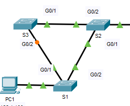

# 8 - Návrh a realizace jednoduché sítě, připojení počítače k lokální síti

## Jak dělíme sítě

### PAN

Personal Area Network (Osobní síť)

Přibližně velmi krátký rozsah (maximálně pár metrů)

Především Bluetooth, USB apod.

Telefon x Sluchátka, Telefon x Telefon (ano přes Bluetooth jdou tahat fotky), …

Používá se především na komunikaci mezi zařízeními

### LAN

Local Area Network (Místní síť)

Krátký dosah (domácnost, firma apod.)

Ethernet, Wifi

Napojení tiskáren, komunikace mezi zařízeními, napojení na router…

Já nevím prostě na všechno, je to to, co máte doma

Skládá se z aktivních a pasivních síťových prvků a koncových zařízení

Aktivní prvky – Router, Switch, Hub (fuj), Firewall apod.

Pasivní prvky – Kabely atd. (nepotřebuje to být v elektřině)

Koncová zařízení – Počítač, server, tiskárna atd.¨

Viz otázka 6.

### MAN

Metropolitan Area Network (Městská síť)

Dosah o rozsahu měst – skládá se z několik LAN sítí

Prostě ve městě jsou baráky a každý barák má vlastní LAN

Z pravidla optika

MAN sítě spravují poskytovatelé internetu

### WAN

Wide Area Network (Rozlehlá Síť)

Větší než město, okres nebo i klidně stát

Internet je WAN

Většinou mobilní signál nebo satelity

## Jak navrhnout síť

Optimálně specializované programy jako Packet Tracer nebo na papír

1. Rozmysleme si, na co budeme síť používat, co po ní chceme a pro koho bude
   1. Například je hloupost kupovat do domácnosti 6 Switchů když by stačil jenom router atd.
   2. V horách je třeba lepší brát signál ze satelitu místo optiky
   3. IPv6? (řekněte ano jinak ústní neprojdete)
2. Přenos
   1. Chceme jet čistě bezdrátově nebo jak po kabelu, tak po Wifi apod.
   2. Odkud budeme brát signál? Ze satelitu, optika…
3. Na co si dát pozor
   1. Útlum
      1. Když táhneme dlouhý signál tak slábne
         1. Porovnání síly signálu u zdroje a cíle
   2. Crosstalk
      1. Vzájemné rušení signálu mezi prvky
      2. Měří se hodnotou NEXT – čím víc tím větší odolnost proti Crosstalku
         1. Tohle jsem v životě neslyšel Horálka nám říct, ale Jarda to tam měl tak idk
   3. Kompatibilita zařízení, které použijeme

## Vlastnosti dobře navržené sítě

### Redundance

Redundace zajišťuje, že pokud přestane fungovat jeden prvek v síti tak sít zůstane ve funkčním stavu a uživatel žádný rozdíl nepozná, nebo bude minimální

#### Redundance Routerů

Redundance u Routerů můžeme dosáhnout použitím protokolu HSRP – Hot Standby Router Protocol, další možnost je použít protokol VRRP – Virtual Router Redundancy Protocol. V podstatě jediný rozdíl, na kterém záleží mezi nimi je, že HSRP je Cisco proprietární.

Třetí možnost je použít GLBP – Global Load Balancing Protocol, ten stejně jako HSRP a VRRP zařizují redundanci, a navíc rozděluje zátěž mezi všechny routery, a ne pouze na jeden.

Všechny tyto protokoly fungují na principu vytvoření virtuálního routeru, který zapíšeme jako default-gateway do počítačů a neřešíme IP adresy jednotlivých routerů

#### Redundance Switchů

Redundance Switchů dosáhneme použít STP (Spanning Tree Protocol).

STP zaručuje redundanci a zároveň zabraňuje „Broadcastové Bouři“, ta nastane, když se zacyklí packety mezi Switchema a zablokují tak síť.

STP zamezuje zacyklení vypnutím cesty, které by vedle k cyklu, na obrázku spoj mezi S3 a S1

Hlavní switch můžeme nastavit nastavením priority, switch s nejvyšší prioritou se jmenuje Root Bridge

## Konfigurace síťové karty ve Windows

1. Otevřeme správce zařízení> Síťové adaptéry > \[naše síťová karta\]
2. Ověříme funkčnost
   1. Windows hlásí problem se zařízením tak, že u něho vyskakuje žlutý vykřičník
   2. Pokud nefunguje je dobré začít aktualizací driver a případnou reinstalací driver
3. Nastavíme IP adresu, masku, gateway, příp. DNS server
   1. Nebo nastavíme přijmutí z DHCP

## Změna názvu PC ve Windows 10

Ve Win11 to asi bude stejný, ale za nic neručím

Nastavení> Systém> O Aplikaci> Upřesnit nastavení systému> Název počítače

## Active Directory (AD)

Proprietární od Microsoftu, používá se na správu několika
počítačů najednou, hlavně pro Bezpečnostní politiku. Nastavuje se na windows serveru.

### Napojení do domény

Název počítače> Je součástí domény> [zadej název domény]

## Konfigurace síťových prvků

Napojíme se konzolovým kabelem na prvek a jedeš
