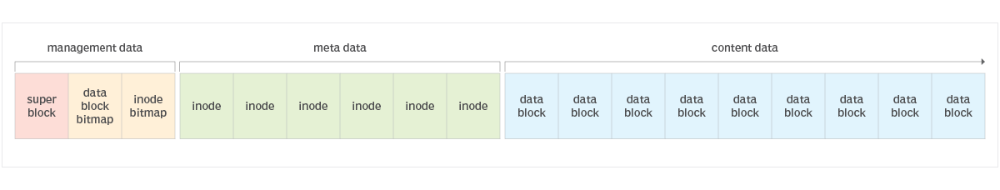
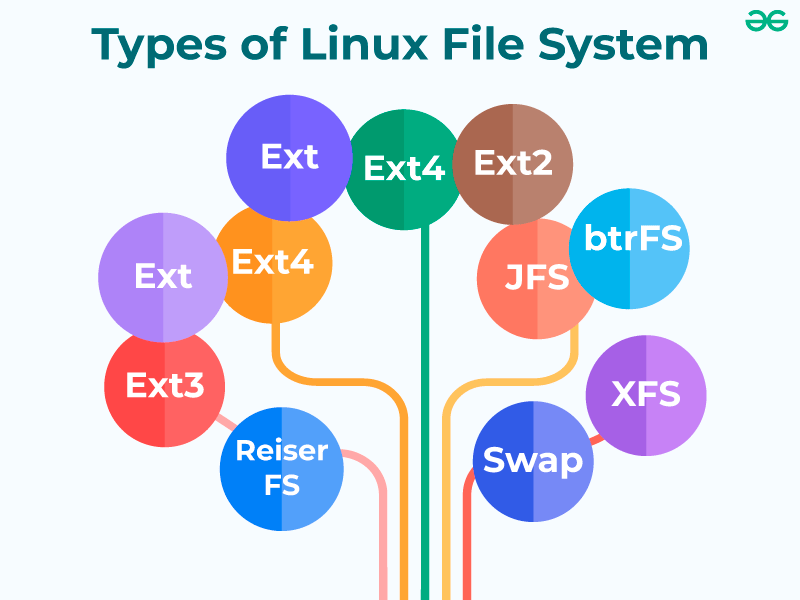
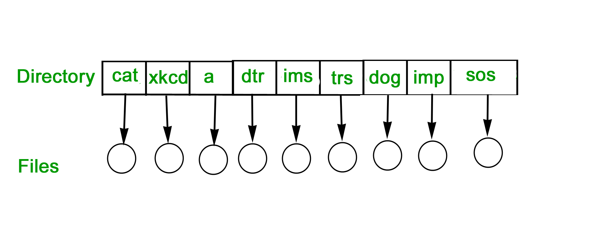
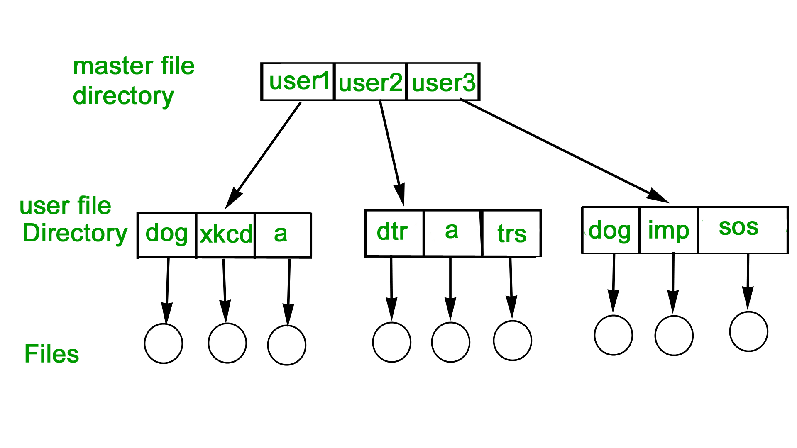

# 10 - Souborové zdroje v síti, správa dat pomocí NTFS teorie/praxe

## Pojmy

- **Swap partion** - Funkce v systému **Linux**, která poskytuje virtuální paměť, samostnaný partion (windows a mac mají swap partion taky, ale je to na stejný partion jako je samotné OS)

## "Co je to souborový systém?" Souborový systém je všechno následující

- Ukládání dat: Primární funkcí každého souborového systému je být strukturovaným místem pro ukládání a načítání dat.

- Namespace: Je to metodika pojmenování a organizace, která poskytuje pravidla pro pojmenování a strukturování dat.

- Bezpečnostní model: Systém pro definování přístupových práv.

- ROZHRANÍ API: Systémová volání funkcí pro manipulaci s objekty souborového systému, jako jsou adresáře a soubory.

- Implementace: Software pro implementaci výše uvedeného.

## Architektura souborového systému

Souborové systémy spravují fyzické i logické operace spojené s manipulací se soubory. Obvykle oddělují metadata od obsahu souborů a ukládají další datové typy pro údržbu a přístup k souborům. Rozdělují oddíl na bloky, jejichž velikost závisí na konkrétním souborovém systému. Většina bloků je využita pro obsah souborů, zatímco zbytek se dělí mezi metadata souborů a data pro správu souborového systému.

### Bloky souborového systému

1. **Superblok**: Obsahuje informace o souborovém systému (typ, počet bloků, počet inodů atd.).
2. **Bitmapa datových bloků**: Indikuje, které datové bloky jsou použité (1) a které ne (0).
3. **Bitmapa inodů**: Indikuje, které inody jsou použité (1) a které ne (0).
4. **Inody**:  Souborový systém udržuje inode pro každý soubor a adresář. Inode je identifikován jedinečným číslem a obsahuje metadata přidruženého souboru nebo adresáře. Obsahuje také adresu datových bloků, které obsahují obsah souboru. Tímto způsobem lze inode použít k rychlému vyhledání souboru.
5. **Bloky s obsahem dat**: Uchovávají samotný obsah souborů.

#### Metadata

- Datum a čas vytvoření
- Datum a čas poslední modifikace
- Datum a čas posledního přístupu
- Vlastník souboru
- Přístupová práva
- Velikost souboru (včetně velikosti na disku)
- Atributy (např. jen pro čtení nebo skrytý soubor)
- Umístění v adresářové struktuře

## Windows

- fat32
  - nepodporuje soubory větší než 4GB
  - nepodporuje úložné kapacitz větší než 32GB

- exFAT
  - maximální velikost souboru: 16 EB
  - nepodporuje "žurnálování"
  - nemá built-in security
  - větší podpora v ostatních OS

### NTFS

- defaultní pro windows 😏 (pokud chceme instalovat na jiné OS, je potřeba manuální driver instalace)
- maximální velikost souboru: 16 EB / exabytes/
- podporuje šifrování (EFS - )
- **podporuje žurnálování**
  - zWaznamenává změny dat, které ještě nebyly zapsány na disk => v případě havárie systému lze žurnál "přehrát" a uvést disk zpět do provozuschopného stavu
- **podporuje oprávnění**
  - Spolupráce s rolemi/oprávněními systému Windows
  - Možnost definovat kdo může používat konkrétní data a k čemu je může může používat
- Komprese
- Dovoluje delší názvy díky Unicode

## Linux

### ext4

- žurnálovací souborový systém
- zpětná kompatibilita s ext3 a ext2 a
- poskytuje několik dalších funkcí, z nichž některé jsou trvalé předpřidělování, neomezený počet podadresářů, kontrolní součet metadat a velká velikost souborů.

### Directory structure - asi navíc

| Systémový adresář | Popis |
| --- | --- |
| / (kořenový souborový systém) | Kořenový souborový systém je adresář nejvyšší úrovně souborového systému. Musí obsahovat všechny soubory potřebné pro spuštění systému Linux před připojením ostatních souborových systémů. Musí obsahovat všechny požadované spustitelné soubory a knihovny potřebné k zavedení zbývajících souborových systémů. Po spuštění systému jsou všechny ostatní souborové systémy připojeny na standardní, dobře definované body připojení jako podadresáře kořenového souborového systému. |
| /bin | Adresář /bin obsahuje spustitelné soubory pro uživatele. |
| /boot | Obsahuje statický zavaděč a spustitelné a konfigurační soubory jádra potřebné k zavedení počítače s Linuxem. |
| /dev | Tento adresář obsahuje soubory zařízení pro každé hardwarové zařízení připojené k systému. Nejedná se o ovladače zařízení, ale o soubory, které představují každé zařízení na počítači a usnadňují přístup k těmto zařízením. |
| /etc | Obsahuje místní konfigurační soubory systému pro hostitelský počítač. |
| /home | Domovský adresář pro ukládání souborů uživatelů. Každý uživatel má podadresář v /home. |

## Mac

- HSF, HSF+
- APFS

### Typy adresářů

- **single level**

- **two level**

- **stromová struktura**

