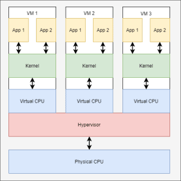
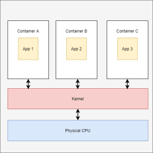
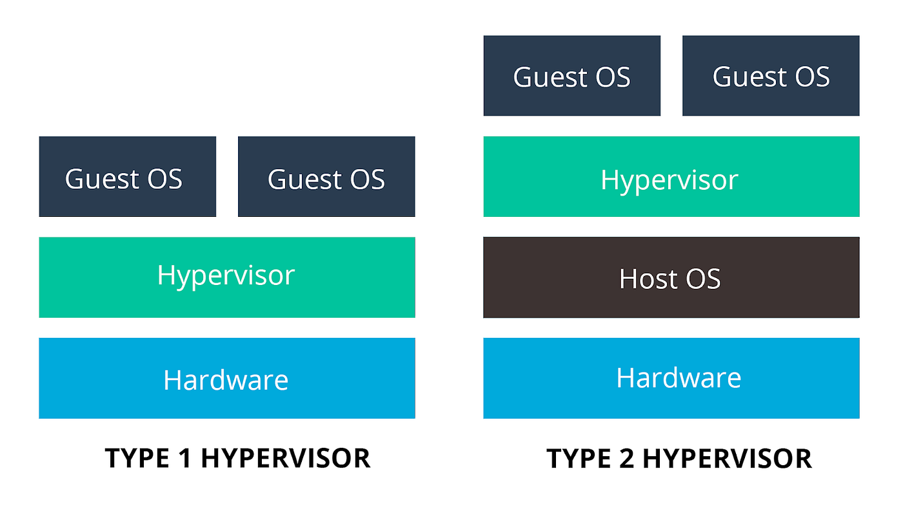

# 12 - Instalace serverového OS a rolí serveru. Základní role - uživatelé a skupiny, servery DHCP a DNS a souborový server

## Pojmy:

- **Role serveru:** Označení pro skupinu funkcí, které běží na serveru
    - Např. DNS + DHCP **role** je na jednom serveru, kde běží DHCPv4 a v6 **služba**, k tomu DNS služba. 
    - Tzn role: proxy, dhcp, dns, Active directory, VPN, print server
- **Server manager** - nástroj pro správu serveru ve WinServeru, kde lze spravovat role a funkce serveru, zařídí dotažení a instalaci potřebných balíčků
- **Active directory** - role pro správu uživatelů, skupin, počítačů, politik, certifikátů, atd. Využívá se pro centralizovanou správu větších sítí. AD zařizuje zřízení domény, nad kterou se potom spravují služby v této doméně.
- **Group policy** - definuje oprávnění, která se nastavují pro "subjekty" AD - možnost přiřazovat uživatele do skupin, dědit mezi nimi oprávnění apod.

---

### Co je virtualizace?

Virtualizace je technologie, která vytváří virtuální verze počítačových prostředků, jako jsou hardwarové platformy, operační systémy, úložná zařízení a síťové prostředky. Je to jako vytvoření softwarové repliky fyzického počítače, což umožňuje provozovat více izolovaných prostředí na stejném hardwaru nebo v distribuovaném systému.

### Co je kontejnerizace?

Kontejnerizace je odlehčená forma virtualizace, která umožňuje spouštět aplikace v izolovaných kontejnerech. Každý kontejner sdílí **stejné jádro operačního systému**, ale je izolován od ostatních kontejnerů, což poskytuje přenosné a konzistentní prostředí pro běh aplikací.

### Virtualizace vs kontejnerizace
| Aspekt             | Virtualizace                                    | Kontejnerizace                                    |
|--------------------|-------------------------------------------------|---------------------------------------------------|
| Izolace            | Každá virtuální stroj běží se svým vlastním operačním systémem hostitele | Kontejnery sdílejí jádro operačního systému hostitele |
| Využití zdrojů     | Každý virtuální stroj vyžaduje vlastní sadu zdrojů | Kontejnery jsou lehké a sdílejí zdroje hostitele |

### Typy virtualizací 

### hypervizor 1. úrovně vs 2. úrovně

**Typ 1:** Tento typ hypervizoru běží přímo na hardwaru hostitele. Protože nepotřebuje operační systém hostitele, poskytuje vyšší výkon a bezpečnost. Typ 1 hypervizory jsou často používány ve velkých datových centrech a pro kritické aplikace, kde je důležitá maximální efektivita a minimalizace zpoždění. 
> Příklady zahrnují VMware, Microsoft Hyper-V a Xen.

**Typ 2:** Na rozdíl od typu 1, hypervizory typu 2 běží na operačním systému hostitele jako aplikace. Tyto jsou vhodné pro testovací prostředí, vývoj a malé produkční nasazení, kde není primárním požadavkem maximální výkon. 
> Příklady zahrnují VMware Workstation, Oracle VirtualBox a Parallels.

**Hlavní funkce**
- Izolace: Hypervizor zajišťuje, že každý virtuální stroj je izolován od ostatních, což znamená, že selhání jednoho VM neovlivní ostatní.
- Alokace zdrojů: Dynamicky přiděluje hardwarové zdroje (CPU, paměť, úložiště) mezi různé VM podle potřeby.

 

## Uveďte hlavní důvody, proč do serveru nasadit serverové řešení
- Bezpečnostní politika
- Správa IP adres a jejich automatické přidělování /DHCP/
- "Doslova cokoliv na co použiješ server" - Adam Pečenka

## Popište funkcionality rolí (active directory certificate services, active directory domain service, dhcp server, dns server, file and storage server, hyperv, windows server update services)

- Active directory
    - Spravuje uživatele
- Active directiry certificate services
    - Poskytuje infrastrukturu pro vytváření a řízení certifikátů v rámci AD
    - umožňuje vydávat, spravovat a odvolávat certifikáty pro uživatele, počítače a služby
- Active directory domain service
    - Používán pro správu identit a přístupu v AD
    - Ukládá a organizuje informace o lidech, zařízeních a službách připojených k síti
- DHCP server
    - DHCPv4 nebo DHCPv6 služba
- DNS server
    - DNS služba
- File and storage server
    - odpovědný za ukládání a správu datových souborů, aby k nim mohly přistupovat další počítače ve stejné síti
    - umožňuje uživatelům sdílet informace v síti, aniž by museli fyzicky přenášet soubory
- Hyperv
    - virtuální mašina přímo na hardware, úplna virtualizace
- Windows server update services
    - role serveru Windows, která dokáže plánovat, spravovat a nasazovat aktualizace, opravy a hotfixy pro servery Windows, klientské (OS) a další software Microsoftu

## Popište důvody nasazení domain controlleru 
- RSA vytváříme nad doménou... potřebujeme něco, co ji bude spravovat

## Popište DHCPv4, DHCPv6 (+ SLAAC)

## Způsob počáteční komunikace mezi klientem a serverem

## Popište DNS a strukturu domén