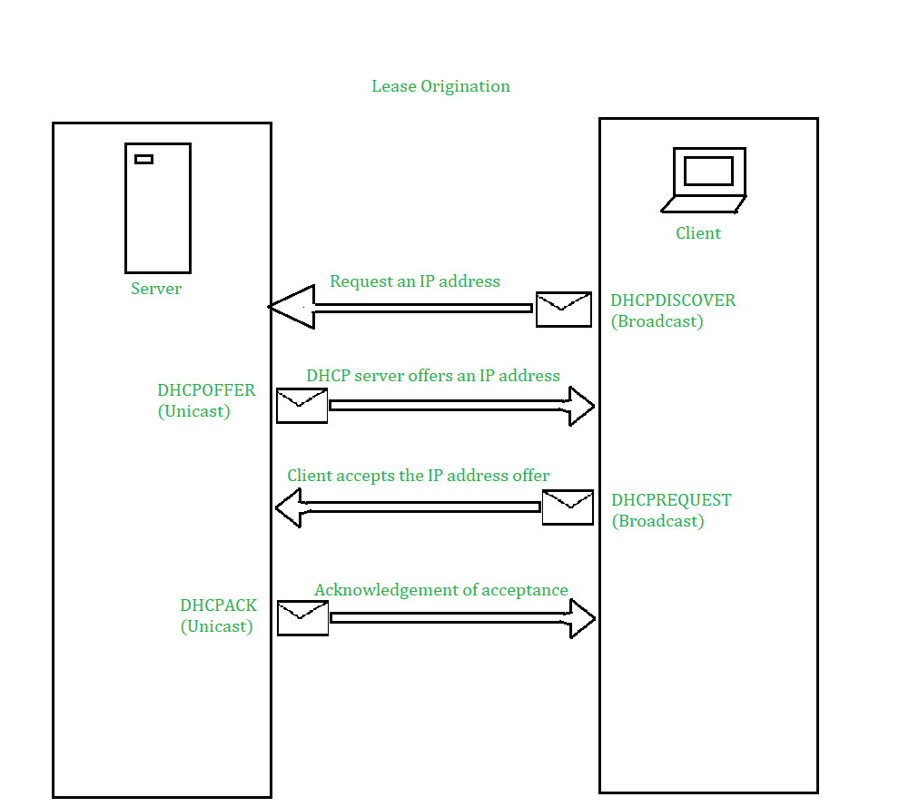
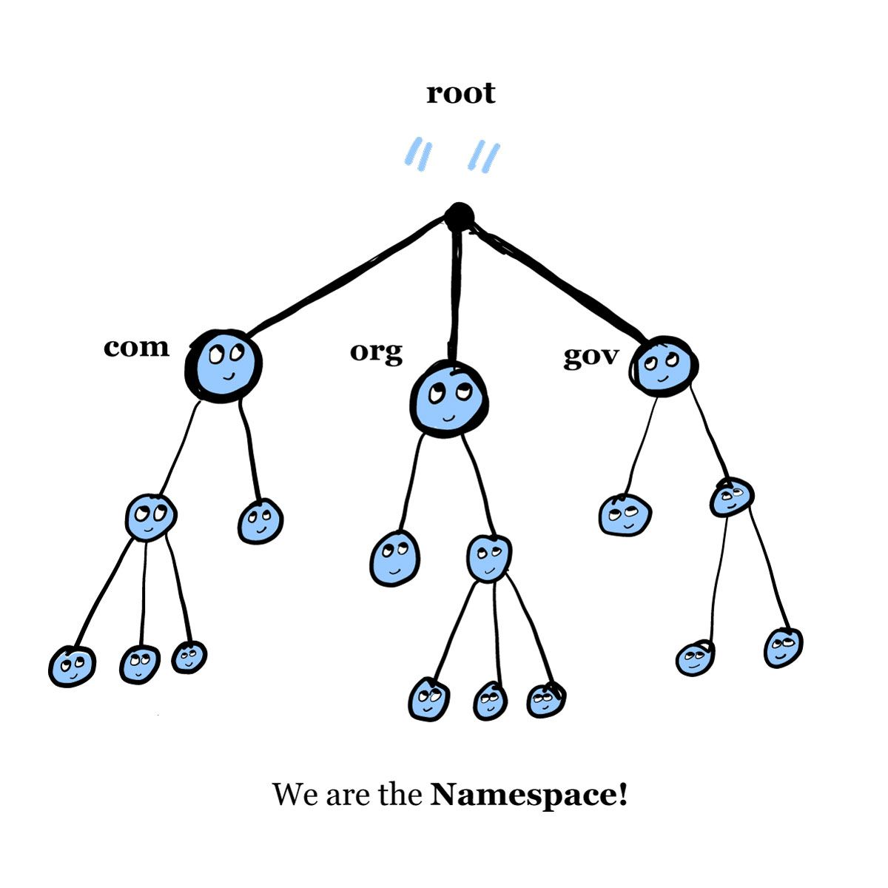
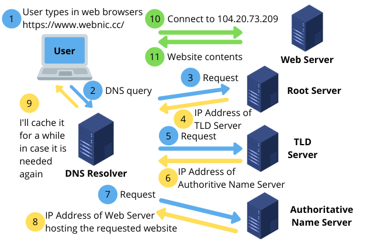
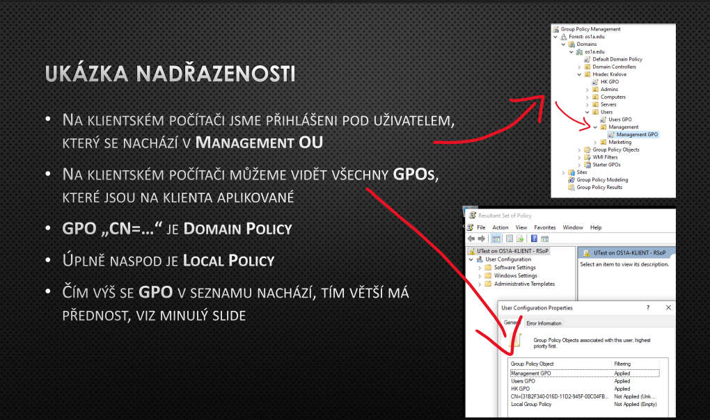

# 12 - Instalace serverového OS a rolí serveru. Základní role - uživatelé a skupiny, servery DHCP a DNS a souborový server

## Pojmy:

- **Role serveru:** Označení pro skupinu funkcí, které běží na serveru
    - Např. DNS + DHCP **role** je na jednom serveru, kde běží DHCPv4 a v6 **služba**, k tomu DNS služba. 
    - Tzn role: proxy, dhcp, dns, Active directory, VPN, print server
- **Server manager** - nástroj pro správu serveru ve WinServeru, kde lze spravovat role a funkce serveru, zařídí dotažení a instalaci potřebných balíčků
- **Active directory** - role pro správu uživatelů, skupin, počítačů, politik, certifikátů, atd. Využívá se pro centralizovanou správu větších sítí. AD zařizuje zřízení domény, nad kterou se potom spravují služby v této doméně.
- **Group policy** - definuje oprávnění, která se nastavují pro "subjekty" AD - možnost přiřazovat uživatele do skupin, dědit mezi nimi oprávnění apod.

---

### Co je virtualizace?

Virtualizace je technologie, která vytváří virtuální verze počítačových prostředků, jako jsou hardwarové platformy, operační systémy, úložná zařízení a síťové prostředky. Je to jako vytvoření softwarové repliky fyzického počítače, což umožňuje provozovat více izolovaných prostředí na stejném hardwaru nebo v distribuovaném systému.


### Co je kontejnerizace?

Kontejnerizace je odlehčená forma virtualizace, která umožňuje spouštět aplikace v izolovaných kontejnerech. Každý kontejner sdílí **stejné jádro operačního systému**, ale je izolován od ostatních kontejnerů, což poskytuje přenosné a konzistentní prostředí pro běh aplikací.


### Virtualizace vs kontejnerizace
| Aspekt             | Virtualizace                                    | Kontejnerizace                                    |
|--------------------|-------------------------------------------------|---------------------------------------------------|
| Izolace            | Každá virtuální stroj běží se svým vlastním operačním systémem hostitele | Kontejnery sdílejí jádro operačního systému hostitele |
| Využití zdrojů     | Každý virtuální stroj vyžaduje vlastní sadu zdrojů | Kontejnery jsou lehké a sdílejí zdroje hostitele |

### Typy virtualizací 

### hypervizor 1. úrovně vs 2. úrovně

**Typ 1:** Tento typ hypervizoru běží přímo na hardwaru hostitele. Protože nepotřebuje operační systém hostitele, poskytuje vyšší výkon a bezpečnost. Typ 1 hypervizory jsou často používány ve velkých datových centrech a pro kritické aplikace, kde je důležitá maximální efektivita a minimalizace zpoždění. 
> Příklady zahrnují VMware, Microsoft Hyper-V a Xen.

**Typ 2:** Na rozdíl od typu 1, hypervizory typu 2 běží na operačním systému hostitele jako aplikace. Tyto jsou vhodné pro testovací prostředí, vývoj a malé produkční nasazení, kde není primárním požadavkem maximální výkon. 
> Příklady zahrnují VMware Workstation, Oracle VirtualBox a Parallels.

**Hlavní funkce**
- Izolace: Hypervizor zajišťuje, že každý virtuální stroj je izolován od ostatních, což znamená, že selhání jednoho VM neovlivní ostatní.
- Alokace zdrojů: Dynamicky přiděluje hardwarové zdroje (CPU, paměť, úložiště) mezi různé VM podle potřeby.

<br/>


## Uveďte hlavní důvody, proč do serveru nasadit serverové řešení
- Bezpečnostní politika
- Správa IP adres a jejich automatické přidělování /DHCP/
- "Doslova cokoliv na co použiješ server" - Adam Pečenka

## Popište funkcionality rolí (active directory certificate services, active directory domain service, dhcp server, dns server, file and storage server, hyperv, windows server update services)

- Active directory
    - Spravuje uživatele
- Active directiry certificate services
    - Poskytuje infrastrukturu pro vytváření a řízení certifikátů v rámci AD
    - umožňuje vydávat, spravovat a odvolávat certifikáty pro uživatele, počítače a služby
- Active directory domain service
    - Používán pro správu identit a přístupu v AD
    - Ukládá a organizuje informace o lidech, zařízeních a službách připojených k síti
- DHCP server
    - DHCPv4 nebo DHCPv6 služba
- DNS server
    - DNS služba
- File and storage server
    - odpovědný za ukládání a správu datových souborů, aby k nim mohly přistupovat další počítače ve stejné síti
    - umožňuje uživatelům sdílet informace v síti, aniž by museli fyzicky přenášet soubory
- Hyperv
    - virtuální mašina přímo na hardware, úplná virtualizace
- Windows server update services
    - role serveru Windows, která dokáže plánovat, spravovat a nasazovat aktualizace, opravy a hotfixy pro servery Windows, klientské (OS) a další software Microsoftu

## Popište důvody nasazení domain controlleru 
- Domain controller je typ serveru, který je nezbytný pro centralizaci uživatelských dat a ochranu zabezpečení sítě
- Nejdůležitější funkcí je zajistit, aby k síťovým prostředkům měli přístup pouze relevantní a důvěryhodní uživatelé, a to prostřednictvím zpracování požadavků na ověření a ověřování uživatelů
- Vynucuje zásady zabezpečení domény


## Popište DHCPv4, DHCPv6 (+ SLAAC)
- DHCPv4 a DHCPv6 jsou služby, které nabízí DHCP server

- **SLAAC (Stateless Address Autoconfiguration)** 
    - Jednoduchá metoda přidělování IPv6 klientům pomocí protokolu NDP (Neighbor Discovery Protocol)
    - Když je zařízení připojeno k síti, odešle zprávu Router Solicitation, aby zjistilo routery v síti. Pokud je router přítomen, odpoví zprávou Router Advertisement (RA) a poskytne informace, jako je výchozí brána a globální unicastový prefix. Klient použije tyto informace a techniku EUI-64 k vytvoření své globální jednosměrové adresy, která je pak platná pro použití v internetu. 
    - SLAAC nevyžaduje žádnou konfiguraci, ale postrádá možnost zadat další informace, jako je nastavení DNS, k čemuž slouží DHCPv6.

- **Stateless DHCPv6**
    - Kombinuje SLAAC s DHCPv6 a poskytuje další konfigurační informace
    - RA zpráva má flag "other-config" nastavený na 1 => klient si zažádá DHCPv6 server pro další informace /třeba nastavení DNS/
    - Server DHCPv6 tyto informace poskytuje bez správy pronájmů adres, proto se používá termín "stateless"

- **Stateful DHCPv6**
    - Podobný protokolu DHCPv4. V tomto přístupu nastavuje zpráva RA flag "managed-config" na 1, který označuje, že klient má používat DHCPv6 server jak pro přidělení adres, tak pro další konfigurační informace. 
    - Server DHCPv6 spravuje pronájmy adres a poskytuje klientovi potřebné údaje.

ukradnuto z: https://www.ictshore.com/free-ccna-course/dhcpv6-basics/

### Způsob počáteční komunikace mezi klientem a serverem


více [zde](/MaturitniOtazky/07%20-%20TCPIP,%20síťové%20služby/README.md#dhcp)

## Popište DNS a strukturu domén
- [Popis DNS](/MaturitniOtazky/07%20-%20TCPIP,%20síťové%20služby/README.md#dns)

- Hiearchie domény se čte zprava doleva 
- Každá doména má dvě části: top-level domain (TLD) a second-level domain (SLD)

ukázka:

```
URL: https://www.freecodecamp.org
Domain name: freecodecamp.com
TLD: org
SLD: freecodecamp
```



- nahoře je "root" -> root doména má zero-lenght label
- na první úrovni od kořene se nacházejí domény nejvyšší úrovně
- pod doménami nejvyšší úrovně se nacházejí domény druhé úrovně (SLD). Děti každého uzlu se nazývají "subdomény", které jsou stále považovány za součást nadřazené domény

ukradnuto z: https://www.freecodecamp.org/news/what-is-dns/

- **Rekurzor DNS** - Rekurzora si můžeme představit jako knihovníka, který je požádán, aby někde v knihovně našel určitou knihu. Rekurzor DNS je server určený k přijímání dotazů z klientských počítačů prostřednictvím aplikací, jako jsou webové prohlížeče. Obvykle je pak rekurzor zodpovědný za zadávání dalších požadavků, aby uspokojil klientův dotaz DNS.

- **Root nameserver** - root server je prvním krokem při překladu (překladu) lidsky čitelných názvů hostitelů na IP adresy. Lze si jej představit jako index v knihovně, který odkazuje na různé regály s knihami - obvykle slouží jako odkaz na další konkrétnější umístění.

- **Jmenný server TLD** - Server domény nejvyšší úrovně (TLD) si lze představit jako konkrétní regál s knihami v knihovně. Tento nameserver je dalším krokem při hledání konkrétní IP adresy a hostí poslední část názvu hostitele 

- **Autoritativní nameserver** - tento poslední nameserver si lze představit jako slovník na regálu knih, ve kterém lze konkrétní jméno přeložit do jeho definice. Autoritativní nameserver je poslední zastávkou v dotazu na nameserver. Pokud má autoritativní jmenný server přístup k požadovanému záznamu, vrátí IP adresu požadovaného hostitelského jména zpět rekurzoru DNS (knihovníkovi), který zadal původní požadavek.

- **Rekurzivní překladač DNS**
    - Rekurzivní resolver je počítač, který odpovídá na rekurzivní požadavek klienta a věnuje čas vyhledání záznamu DNS. Provádí to tak, že provádí řadu požadavků, dokud nedosáhne autoritativního jmenného serveru DNS pro požadovaný záznam (nebo pokud žádný záznam nenajde, ukončí se nebo vrátí chybu). Naštěstí rekurzivní DNS resolvery nemusí vždy provádět více požadavků, aby dohledaly záznamy potřebné k odpovědi klientovi; ukládání do mezipaměti je proces perzistence dat, který pomáhá zkrátit potřebné požadavky tím, že požadovaný záznam prostředku doručí dříve v rámci vyhledávání DNS.

ukradnuto z : https://www.cloudflare.com/learning/dns/what-is-dns/ 




# I guess navíc

## Group policy management


