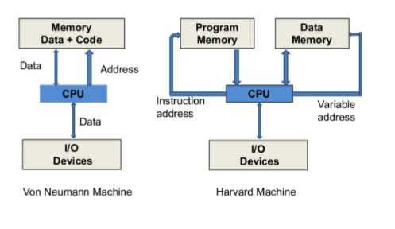

# Obsahuje pojmy, které nevím, kam zařadit

## Socket

- Sokety umožňují meziprocesovou komunikaci mezi programy spuštěnými na jednom počítači nebo mezi programy spuštěnými na různých počítačích. Programy, které komunikují prostřednictvím síťových soketů, obvykle využívají k odesílání a přijímání dat internetový protokol (IP).
- Existuje řada různých typů soketů. Mezi nejběžnější patří:
  - **Stream sockets**  : používají protokol TCP k zapouzdření a zajištění spolehlivého doručení proudu dat
  - **Datagram sockets**: používají protokol UDP k přenosu datagramů, aniž by bylo nutné navázat trvalé spojení mezi systémy
  - **Unix Domain Sockets**: používají k odesílání a přijímání dat místní soubory namísto síťových rozhraní a paketů I
  - **Raw sockety**:  umožňují aplikacím vytvářet a upravovat pakety namísto spoléhání se na hostitelský OS

## Pipe

- Roura je technika pro předávání informací z jednoho programového procesu nebo příkazu do druhého
- Roura týká pouze jednosměrné komunikace
- V unixových systémech se roura zadává v příkazovém řádku jako jednoduchá svislá čárka ( | ) mezi dvěma příkazovými sekvencemi

> $ Cat names.txt | sort

**Roury i sokety zpracovávají proudy bajtů, ale dělají to různými způsoby...**

- roury existují pouze v rámci určitého hostitele a týkají se vyrovnávací paměti mezi virtuálními soubory nebo propojení výstupu / vstupu procesů v rámci tohoto hostitele. V rámci rour neexistují žádné koncepty paketů.

- Sokety paketují komunikaci pomocí protokolu IPv4 nebo IPv6; tato komunikace může přesahovat lokálního hostitele. Různé koncové body soketu mohou sdílet stejnou IP adresu; musí však naslouchat na různých portech TCP / UDP, aby tak mohly činit.

## Harvard achitecture vs Von Neumann

V běžném počítači s von Neumannovou architekturou jsou instrukce i data uloženy ve stejné paměti. Pro načítání instrukcí a dat se tedy používají stejné sběrnice. To znamená, že procesor nemůže provádět obě činnosti současně (číst instrukce a číst/zapisovat data). Harvardská architektura je architektura počítače, která obsahuje oddělenou paměť a oddělené sběrnice (signální cesty) pro instrukce a data. Byla v podstatě vyvinuta k překonání úzkého místa Von Neumannovy architektury. Hlavní výhodou oddělených sběrnic pro instrukce a data je, že procesor může přistupovat k instrukcím a číst/zapisovat data současně.

### Sběrnice

Sběrnice se používají jako signální cesty. V harvardské architektuře existují samostatné sběrnice pro instrukce a data. Typy sběrnic:

- Datová sběrnice: Přenáší data mezi hlavním paměťovým systémem, procesorem a I/O zařízeními.

- Sběrnice datových adres: Přenáší adresu dat z procesoru do hlavního paměťového systému.

- Instrukční sběrnice: Přenáší instrukce mezi hlavním paměťovým systémem, procesorem a I/O zařízeními.

- Instrukční adresová sběrnice: Přenáší adresu instrukcí z procesoru do hlavního paměťového systému.

## North vs south bridge

| Severní můstek | Jižní můstek |
| --- | --- |
| Přímo připojen k CPU | Připojen k CPU přes severní můstek |
| Spravuje komunikaci mezi CPU a ostatními částmi základní desky | Spravuje vstupní a výstupní funkce |
| Severní můstek je umístěn blízko procesoru pro snadný přístup | Jižní můstek je umístěn blízko PCI |
| Severní můstek komunikuje rychleji | Jižní můstek komunikuje pomaleji |
