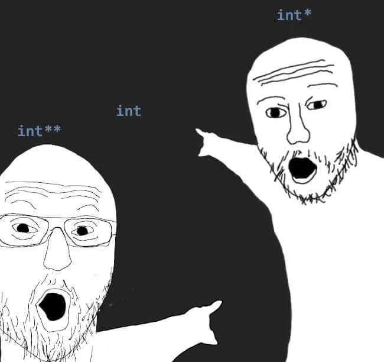

# 22 Data a datové typy

datové typy, reprezentace v paměti, přetypování, silně a slabě typované jazyky, statické a dynamické datové struktury, obecné typy, předávání proměnné hodnotou/odkazem

## Základní/Jednoduché datové typy

- Char (ne string)
- Číslo
- Bool

V podstatě je všechno číslo, char je číslo v tabulce, číslo je číslo (duh), bool je 0 nebo 1

## Složité datové typy

### Čísla

#### Signed X Unsinged

Unsigned mají plnou hodnotu, ale nemohou jít do mínusu, signed mají hodnotu poloviční, ale mohou do mínusu, protože používají první bit jako indikátor znaménka. Každé číslo může být singed nebo unsigned

#### Byte

8 bitů ... 0 až 255

00000000 - používá se celý byte

##### Signed byte

7 bitů ... -127 až 127

0|0000000 - první bit se používá pro znaménko - 0 +, 1 -

#### int apod.

V C# se int skládá ze 4 bytů, v jiných jazycích se to může lišit, ale všechno to funguje stejně jako signed a unsigned byte

#### float

Floating point číslo (desetinné)

Skládá se ze tří částí sign, exponent a mantissa

$$
4,206923 * 10^4 = 42069,23
$$

Mantissa je v našem případě 4,206923

Exponent je 4

Sign je 0

Pro float se většinou používá 64 bitů, 1 bit pro sign, 11 pro exponent a zbytek pro mantissu

Floating point čísla jsou nepřesná

Třeba `float == float` bude prakticky vždycky `false`, protože je téměř nemožné dostat z početních operací identický float, když chceme porovnat jestli se 2 floaty rovnají musíme je porovnávat v rozmezí od sebe a ne zda mají identickou hodnotu, některé jazyky to dělají implicitně

Typickým příkladem pro nepřesnost floatů je `0.1 + 0.2` správně by mělo vyjít `0.3`, ale vyjde `0.30000000000000004`

## Složené datové typy

pole (array)

string: string je pouze pole charů

Objekty

## Stack a Heap

### Stack

Ukládá jednoduché typy a pointery na Heap



Pointer ukazuje kde se nachází proměnná v paměti, v C se označuje \*

Celý Stack pracuje na principu LIFO, můžeme do něj rychle zapisovat a rychle číst

Proměnné ve stacku se při předání kopírují

### Heap

Do heapu se ukládají objekty, pole a podobně, zkrátka všechno co je definováno klíčovým slovem new

Pomalý zápis, pomalé čtení

Proměnné v heapu se při předání vytvoří pouze pointer

Zjednodušeně řečeno, v Heapu je bordel, Stack je organizovaný

## Přetypování

Většina jazyků povoluje implicitní přetypování. To je povoleno pouze v případě, že nedojde ke ztrátě dat, například int -> double, pokud jsme ochotni podstoupit možnou ztrátu dat musíme přetypovat explicitně, v C# pomocí `(typ)`.

## Strong x Weak typed jazyky

Nikdo se nedokáže shodnout co dělá z jazyku Strong nebo Weak typed jazyk (politickou diskuzi prosim do issues)

Obecně se dá říct, že Strong typed jazyky více vzdorují při změnách typu, třeba nemají implicitní změny, a weak typed jazyky vás nechají. Obecně bych stočil u maturity k dynamickým a statickým jazkům

Lidově řečeno, čim víc Strong typed tim víc vás kompilátor nutí nedělat s typama kraviny, např. C je weakly typed, protože vám dovolí převést string na float a je na vás se vyrovnat s následky

## Dynamické x Statické jazyky

Dynamické jazyky kontrolují typy proměnných při runtimu, Statické jazyky při kompilaci. Typicky statické jazyky jsou Java nebo C#, dynamické Javascript

## Generické typy

C# nám umožňuje vytvářet třídy, které mohou přijmout proměnnou o jakémkoliv typu pomocí typu T, pokud je to potřeba můžeme i upřesnit T pomocí where

```csharp
public class Trida<T> where T: IComparable
{
    ...
}
Zdroj: https://www.itnetwork.cz/csharp/kolekce-a-linq/c-sharp-tutorial-uvod-do-kolekci-a-genericita
```

aaa
